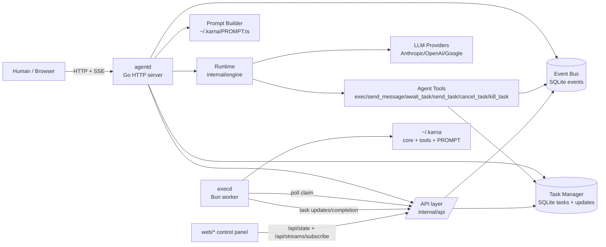
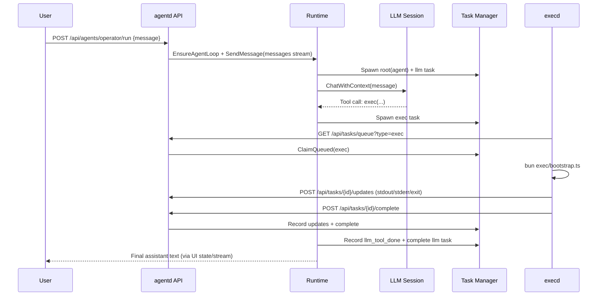
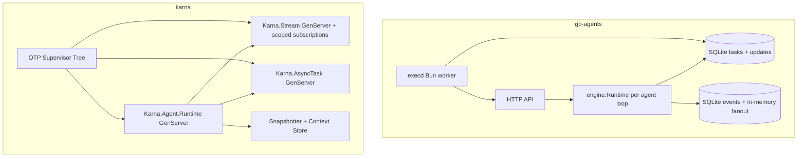

# Architecture Review: go-agents

This document reviews the current architecture with emphasis on the **agentic runtime** (`internal/engine`, `internal/agenttools`, `internal/tasks`, `internal/eventbus`, `exec/execd.ts`), then proposes practical improvements.

## 1) Executive Summary

`go-agents` is a compact **agent runtime control plane**:

- `agentd` hosts HTTP API + web UI and orchestrates agents.
- A SQLite-backed task/event substrate provides durable state.
- Agent loops are event-driven (`messages` stream), invoke LLM tools, and emit task updates.
- `execd` is the primary worker for `exec` tasks, running Bun/TypeScript in a sandbox-like temp workspace with optional snapshot state.

The architecture is strong for rapid iteration and observability, but has a few high-impact reliability/scaling risks in queueing and subscription semantics (detailed in section 8).

## 2) System Context



## 3) Repository Architecture

### Runtime / Agentic Core

- `internal/engine`: agent session state, loop orchestration, LLM streaming/tool event recording, interrupt handling.
- `internal/agenttools`: first-class tool contracts for task spawn/wait/send/cancel/kill and cross-agent messaging.
- `internal/ai`: provider abstraction and LLM session construction.
- `internal/prompt` + `template/*`: dynamic system prompt generation from `~/.karna/PROMPT.ts`.

### Coordination + Persistence

- `internal/tasks`: durable task graph (`tasks`, `task_updates`) + lifecycle APIs (`Spawn`, `Await`, `ClaimQueued`, etc.).
- `internal/eventbus`: durable event log with stream semantics (`messages`, `signals`, `task_output`, etc.) and in-memory fan-out subscriptions.
- `internal/state`: SQLite schema/migration/connection configuration.

### API / UX / Workers

- `internal/api`: minimal runtime/task/event endpoints + SSE stream.
- `web/*`: operations UI over `/api/state` and SSE.
- `exec/execd.ts`: external worker process for `exec` task execution.
- `exec/bootstrap.ts`: isolated per-task entrypoint for code execution + state snapshot I/O.

## 4) Agentic Runtime Flow

### 4.1 Agent Message Processing

1. Caller hits `POST /api/agents/{id}/run`.
2. API sets per-agent system/model overrides and ensures the loop exists.
3. API sends message into `messages` stream scoped to the agent.
4. Runtime loop (`Run`) consumes message events and calls `HandleMessage`.
5. `HandleMessage`:
   - builds prompt (`PROMPT.ts` via Bun),
   - spawns/updates `agent` + `llm` tasks,
   - streams LLM/tool updates into `task_updates`,
   - optionally replies to source agent.

### 4.2 Exec Tool Flow

1. LLM calls `exec` tool.
2. `ExecTool` creates an `exec` task (`tasks.Spawn`) with code payload.
3. `execd` claims queued `exec` tasks from `/api/tasks/queue?type=exec`.
4. `execd` runs `exec/bootstrap.ts` in a temp directory, optionally loading/saving snapshot by `id`.
5. `execd` posts updates (`stdout`, `stderr`, `exit`) and completion/failure.
6. Agent can `await_task` or continue asynchronously.

### 4.3 Wake / Interrupt Control

- Runtime watches `signals/errors/external/messages` while an LLM task is running.
- `priority=interrupt` events cancel current run and mark task cancelled/killed.
- `Await`/`AwaitAny` can return early with wake errors on wake/interrupt events.

## 5) Sequence Diagram (LLM + Exec)



## 6) Key Code Samples

### Sample A: runtime startup wiring
`cmd/agentd/main.go`

```go
bus := eventbus.NewBus(db)
manager := tasks.NewManager(db, bus)
rt := engine.NewRuntime(bus, manager, nil)
execTool := agenttools.ExecTool(manager)
sendMessageTool := agenttools.SendMessageTool(bus, rt.EnsureAgentLoop)
awaitTaskTool := agenttools.AwaitTaskTool(manager)
sendTaskTool := agenttools.SendTaskTool(manager, bus)
cancelTaskTool := agenttools.CancelTaskTool(manager)
killTaskTool := agenttools.KillTaskTool(manager)
```

### Sample B: `exec` tool creates durable work
`internal/agenttools/exec.go`

```go
spec := tasks.Spec{
  Type:     "exec",
  Owner:    "llm",
  ParentID: parentID,
  Metadata: metadata,
  Payload: map[string]any{
    "code": code,
    "id":   strings.TrimSpace(p.ID),
  },
}
task, err := manager.Spawn(r.Context(), spec)
```

### Sample C: runtime loop consumes messages by agent scope
`internal/engine/agent.go`

```go
sub := r.Bus.Subscribe(ctx, []string{"messages"})
for {
  select {
  case <-ctx.Done():
    return ctx.Err()
  case evt, ok := <-sub:
    if !ok { return ctx.Err() }
    if evt.Body == "" || !eventTargetsAgent(evt, agentID) { continue }
    _, _ = r.HandleMessage(ctx, agentID, source, evt.Body)
    _ = r.Bus.Ack(ctx, "messages", []string{evt.ID}, agentID)
  }
}
```

### Sample D: `exec` bootstrap persists cross-call state
`exec/bootstrap.ts`

```ts
const state: ExecState = {}
if (snapshotIn) {
  const parsed = JSON.parse(await Bun.file(snapshotIn).text())
  Object.assign(state, parsed)
}
(globalThis as any).state = state
await import(codeFile)
await Bun.write(snapshotOut, JSON.stringify((globalThis as any).state, null, 2))
```

## 7) Strengths

1. Clean separation of concerns between control plane (`agentd`) and execution plane (`execd`).
2. Durable task/event records in SQLite improve debugging and local reproducibility.
3. Excellent observability primitives:
   - structured task updates,
   - SSE stream subscription,
   - optional LLM raw debug events.
4. Practical multi-agent affordances:
   - scoped messaging,
   - subagent spawning (`template/core/agent.ts`),
   - task-level cancellation and waiting.
5. Simple extensibility model for tools and prompt composition.

## 8) Architectural Risks and Gaps

Status update (implemented in this branch):

- Queue claim race mitigated with guarded status update semantics in `ClaimQueued`.
- `Await` subscription lifecycle and wake scope filtering are fixed.
- Message loss impact from in-memory fanout drops is reduced for agent loops via durable unread replay.

### Critical

1. **Message ack currently occurs regardless of turn success**
   - Runtime acks message events even when `HandleMessage` returns an error.
   - Impact: transient failures can become permanent message loss.

2. **Task status transitions are not guarded**
   - `Complete`/`Fail`/`Cancel` use unconditional status updates.
   - Impact: terminal state races can overwrite each other under retries/concurrency.

3. **Best-effort in-memory fanout can drop events for slow consumers**
   - `eventbus.broadcast` drops when subscriber channel is full.
   - Agent loops recover message drops via unread replay, but other subscribers still rely on live delivery.
   - Impact: missed wake/interrupt/control events for non-loop subscribers.

### High

4. **No lease/heartbeat reclaim for running tasks**
   - Claimed tasks can remain `running` if workers die mid-execution.
   - Impact: stuck tasks and manual/operator intervention.

5. **No supervisor abstraction for agent loops**
   - Per-agent loops are goroutines without explicit restart/backoff policy.
   - Impact: reduced resilience during runtime faults.

6. **Single-threaded per-agent run loop can amplify event drops**
   - `Run` handles each message synchronously through full LLM/tool cycle.
   - Under long calls, channel backlog can overflow and trigger dropped message fanout.

### Medium

7. **Task tree operations are metadata-scan based**
   - Parent linkage is stored in metadata JSON; child discovery scans all tasks.
   - Impact: O(N) scans and weaker query/index semantics for hierarchy operations.

8. **Prompt build is runtime Bun execution on every run**
   - Flexible but adds latency and operational dependency on `bun` + user home scripts.
   - Impact: startup/runtime fragility if prompt scripts fail.

9. **API has no authn/authz boundaries**
   - Full control endpoints exposed by default.
   - Impact: unsafe for any non-local deployment.

10. **Two worker paths increase maintenance drift**
   - `exec/execd.ts` and `internal/execworker/*` overlap.
   - Impact: duplicated behavior surface and test burden.

## 9) Recommended Evolution Path

1. **Add lease + heartbeat semantics to task claiming**
   - Extend claim model with `claimed_by` + `lease_until`.
   - Reclaim stale running tasks automatically.

2. **Promote DB-backed queue semantics for message consumption**
   - Keep fanout for UI, but agent loops should claim/lease messages from durable storage.
   - Preserve at-least-once guarantees with explicit ack deadlines.

3. **Guard task lifecycle transitions**
   - Enforce allowed status transitions in SQL updates.
   - Record rejected transitions as diagnostic updates.

4. **Normalize task hierarchy in schema**
   - Add explicit `parent_id` column + index.
   - Keep metadata as auxiliary, not primary relation storage.

5. **Harden runtime boundary**
   - Add optional auth token or localhost-only guard.
   - Add API-level rate limiting and bounded payload sizes.

6. **Clarify worker architecture**
   - Choose one production worker implementation (`exec/execd.ts` appears primary).
   - Keep the Go `internal/execworker` path either integrated or removed to reduce divergence.

## 10) Testing Posture

Current tests cover key flows well:

- end-to-end exec path (`internal/e2e/exec_flow_test.go`)
- runtime loop and interruption (`internal/engine/*_test.go`)
- task lifecycle + wake semantics (`internal/tasks/*_test.go`)
- event bus contention and ordering (`internal/eventbus/*_test.go`)

Missing stress areas:

1. status transition race tests (`complete` vs `cancel`/`fail`) with concurrent writers.
2. worker crash + stale lease reclaim tests for `running` task recovery.
3. message failure semantics tests (retry/dead-letter vs immediate ack).
4. high-volume control-stream tests for wake/interrupt reliability under fanout pressure.

## 11) Architectural Takeaway

The core design is a good foundation: a local-first agent control plane with durable introspection and composable tools. The next step is reliability hardening around queue/stream semantics so the agentic framework remains correct under concurrency and sustained throughput, not just under light interactive load.

## 12) Comparative Review vs `../karna`

This section compares `go-agents` to `../karna` with focus on the agent runtime model.

### 12.1 Runtime Topology Comparison



### 12.2 Architectural Delta Summary

| Dimension | `go-agents` | `karna` |
|---|---|---|
| Runtime model | Per-agent goroutine loop (`internal/engine/agent.go`) | GenServer runtime with explicit state machine (`lib/karna/agent/runtime.ex`) |
| Failure recovery | Best effort; loop recreated via `EnsureAgentLoop` call path | OTP supervision + restart strategy (`lib/karna/application.ex`) |
| Stream semantics | Durable DB events + lossy in-memory fanout (`internal/eventbus/bus.go`) | Scoped stream process with filtered subscriptions, wake routing, unread checks (`lib/karna/stream.ex`) |
| Async task orchestration | SQLite task rows + update rows (`internal/tasks/manager.go`) | AsyncTask lifecycle process with command dispatch/signal/cancel hooks (`lib/karna/async_task.ex`) |
| Agent policy model | Single runtime behavior, optional system/model override | Profile-driven runtime (`operator`, `front_desk`, `subagent`, `controller`) |
| Context lifecycle | Prompt rebuilt each run; no runtime snapshot restore | Snapshot + compaction + resume workflows (`lib/karna/agent/runtime.ex`) |
| Safety boundary | No API authn/authz in server handlers | Guardian + stronger process isolation posture |
| Tool execution governance | Tool set assembled at startup; no policy layer | Toolbox choice modes + action logging wrappers (`lib/karna/tools/toolbox.ex`) |

### 12.3 Findings (Severity Ordered)

#### Critical

1. **No supervised self-healing loop hierarchy**
   - `go-agents` loops are goroutines tracked in-memory (`internal/engine/agent.go`), but there is no dedicated supervisor with restart backoff or crash telemetry.
   - `karna` uses OTP supervision as a first-class runtime primitive (`lib/karna/application.ex`).
   - Risk: runtime stalls after goroutine exits due internal error without deterministic restart policy.

2. **Message event is acked even when `HandleMessage` fails**
   - In `handleMessageEvent`, message ack happens regardless of `HandleMessage` error (`internal/engine/agent.go`).
   - Risk: at-least-once delivery degrades to at-most-once under transient LLM/tool failures.

3. **Task status transitions are not guarded by current state**
   - `updateStatus` overwrites status without a transition guard (`internal/tasks/manager.go`).
   - `Cancel`/`Kill` can overwrite terminal states recursively.
   - Risk: inconsistent lifecycle state under race/retry conditions.

#### High

4. **Await path can miss pre-existing wake/interrupt events**
   - `Await` subscribes then waits on live fanout without first reading unread wake events (`internal/tasks/manager.go`).
   - `karna` pre-checks unread events before blocking (`lib/karna/agent/awaiter.ex`).
   - Risk: slow interrupt response or spurious await timeouts.

5. **Queue model lacks leases/heartbeats/reclaim**
   - Claimed tasks move to `running`, but reclaim policy for crashed workers is indirect (`internal/tasks/manager.go`, `internal/engine/agent.go` task health wake signal).
   - `karna` models cancellable async tasks with command signals and lifecycle hooks (`lib/karna/async_task.ex`).
   - Risk: stuck `running` tasks and manual cleanup burden.

6. **Lossy subscriber fanout remains part of control signaling**
   - `eventbus.broadcast` drops events for slow subscribers (`internal/eventbus/bus.go`).
   - Agent loop now has unread replay for `messages`, but other consumers still depend on live fanout.
   - Risk: missed control events under burst load.

#### Medium

7. **Task hierarchy is metadata-encoded instead of schema-first**
   - Child traversal scans all tasks and parses metadata JSON (`internal/tasks/manager.go`).
   - Risk: poor scale characteristics and weaker referential integrity.

8. **Runtime has no profile-level policy abstraction**
   - `go-agents` can target many agent IDs but all share one behavior.
   - `karna` profile interface allows agent-specific model/tool/stream policy (`lib/karna/agent/runtime.ex` + profile modules).
   - Risk: policy drift as features grow (front desk, operator, subagents) with ad hoc conditionals.

9. **Two exec worker implementations increase drift risk**
   - `exec/execd.ts` is active path; `internal/execworker/*` duplicates similar behavior.
   - Risk: inconsistent semantics and duplicated maintenance/test surface.

10. **Control plane endpoints are unauthenticated**
   - `/api/tasks/*`, `/api/agents/*`, `/api/streams/subscribe` currently have no auth guards (`internal/api/server.go`).
   - Risk: unsafe outside localhost.

### 12.4 Side-by-Side Runtime Samples

`go-agents` message loop (synchronous message-to-turn execution):

```go
// internal/engine/agent.go
sub := r.Bus.Subscribe(ctx, []string{"messages"})
for {
  select {
  case evt := <-sub:
    r.handleMessageEvent(ctx, agentID, evt)
  }
}
```

`karna` runtime (stateful process + pending work scheduler):

```elixir
# lib/karna/agent/runtime.ex
def handle_info(:process_pending_work, state) do
  if ready_for_work?(state) do
    {:noreply, process_pending_work(state)}
  else
    {:noreply, state}
  end
end
```

## 13) Potential Improvements for `go-agents` Runtime

Prioritized list intended for discussion and staged implementation.

### 13.1 Phase 1 (Reliability Core)

1. Introduce a **runtime supervisor** for agent loops:
   - Owned restart policy (backoff, max retries, fatal state surfacing).
   - Persist loop liveness state in DB for ops visibility.

2. Add a **task state machine** with transition guards:
   - Allowed transitions only (`queued -> running -> completed|failed|cancelled`).
   - Reject terminal-to-terminal overwrites unless explicit force flag.

3. Build **lease-based queue claiming**:
   - `claimed_by`, `lease_until`, heartbeat updates, and timed reclaim.
   - Keep current `ClaimQueued` API but back it with lease semantics.

4. Make message ack conditional on success policy:
   - Ack on success.
   - On transient failure: retry with capped attempt metadata.
   - On permanent failure: dead-letter stream plus ack.

### 13.2 Phase 2 (Agentic Capabilities)

5. Add a **profile interface** for agent classes:
   - Runtime callbacks: `poll`, `build_turn`, `toolset`, `stream_policy`, `max_turns`.
   - Start with `operator` and `front_desk` profiles.

6. Move await/wake to **unread-first semantics**:
   - Pre-check unread wake/task_output before subscribe-wait.
   - Add task_id/priority filters to subscriptions.

7. Normalize schema for hierarchy and routing:
   - Add explicit `parent_id`, `notify_target`, `input_target`, `mode` columns.
   - Keep metadata for non-indexed extension fields only.

8. Consolidate worker runtime:
   - Pick one exec worker path (`execd.ts` or Go worker) and remove the other.
   - Preserve feature parity with snapshot + stdin streaming + cancellation.

### 13.3 Phase 3 (Operations and Safety)

9. Add authn/authz boundary:
   - Localhost-only default.
   - Optional bearer token or mTLS for remote operation.

10. Add runtime observability contract:
   - Metrics for loop lag, queue depth, retries, wake interrupts, lease expiry.
   - Correlation IDs from API request -> task -> tool updates -> stream events.

11. Add snapshot/resume support:
   - Snapshot runtime session state periodically.
   - Resume unfinished turns after restart with replay protection.

12. Add policy guardrails for tools:
   - Per-agent tool allowlists.
   - Timeout/cost budget policies.
   - Structured audit trail for tool calls.

## 14) Suggested Discussion Order

1. Reliability contract: decide target guarantees (`at-most-once` vs `at-least-once`) for messages and tasks.
2. Runtime model: decide whether to stay goroutine-centric or introduce a supervised runtime manager.
3. Profile model: decide minimum profile abstraction needed for operator/front_desk split.
4. Worker strategy: choose a single long-term exec worker implementation.
5. Security envelope: define localhost-only vs remote multi-user deployment requirements.
