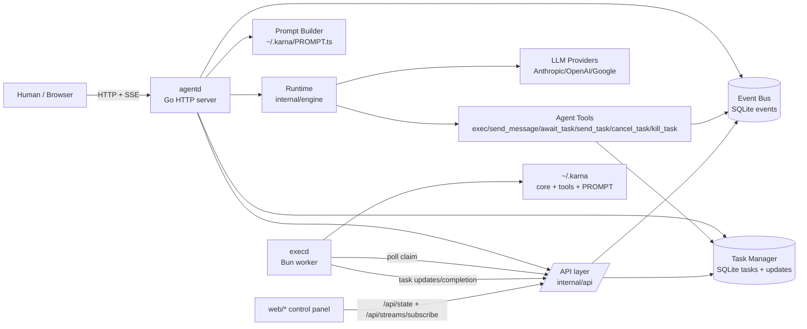
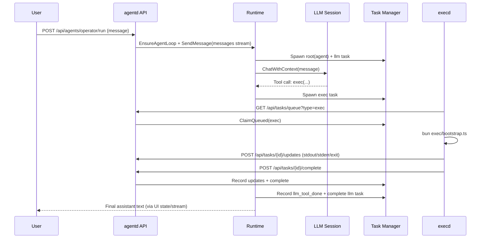

# Architecture Review: go-agents

This document reviews the current architecture with emphasis on the **agentic runtime** (`internal/engine`, `internal/agenttools`, `internal/tasks`, `internal/eventbus`, `exec/execd.ts`), then proposes practical improvements.

## 1) Executive Summary

`go-agents` is a compact **agent runtime control plane**:

- `agentd` hosts HTTP API + web UI and orchestrates agents.
- A SQLite-backed task/event substrate provides durable state.
- Agent loops are event-driven (`messages` stream), invoke LLM tools, and emit task updates.
- `execd` is the primary worker for `exec` tasks, running Bun/TypeScript in a sandbox-like temp workspace with optional snapshot state.

The architecture is strong for rapid iteration and observability, but has a few high-impact reliability/scaling risks in queueing and subscription semantics (detailed in section 8).

## 2) System Context



## 3) Repository Architecture

### Runtime / Agentic Core

- `internal/engine`: agent session state, loop orchestration, LLM streaming/tool event recording, interrupt handling.
- `internal/agenttools`: first-class tool contracts for task spawn/wait/send/cancel/kill and cross-agent messaging.
- `internal/ai`: provider abstraction and LLM session construction.
- `internal/prompt` + `template/*`: dynamic system prompt generation from `~/.karna/PROMPT.ts`.

### Coordination + Persistence

- `internal/tasks`: durable task graph (`tasks`, `task_updates`) + lifecycle APIs (`Spawn`, `Await`, `ClaimQueued`, etc.).
- `internal/eventbus`: durable event log with stream semantics (`messages`, `signals`, `task_output`, etc.) and in-memory fan-out subscriptions.
- `internal/state`: SQLite schema/migration/connection configuration.

### API / UX / Workers

- `internal/api`: minimal runtime/task/event endpoints + SSE stream.
- `web/*`: operations UI over `/api/state` and SSE.
- `exec/execd.ts`: external worker process for `exec` task execution.
- `exec/bootstrap.ts`: isolated per-task entrypoint for code execution + state snapshot I/O.

## 4) Agentic Runtime Flow

### 4.1 Agent Message Processing

1. Caller hits `POST /api/agents/{id}/run`.
2. API sets per-agent system/model overrides and ensures the loop exists.
3. API sends message into `messages` stream scoped to the agent.
4. Runtime loop (`Run`) consumes message events and calls `HandleMessage`.
5. `HandleMessage`:
   - builds prompt (`PROMPT.ts` via Bun),
   - spawns/updates `agent` + `llm` tasks,
   - streams LLM/tool updates into `task_updates`,
   - optionally replies to source agent.

### 4.2 Exec Tool Flow

1. LLM calls `exec` tool.
2. `ExecTool` creates an `exec` task (`tasks.Spawn`) with code payload.
3. `execd` claims queued `exec` tasks from `/api/tasks/queue?type=exec`.
4. `execd` runs `exec/bootstrap.ts` in a temp directory, optionally loading/saving snapshot by `id`.
5. `execd` posts updates (`stdout`, `stderr`, `exit`) and completion/failure.
6. Agent can `await_task` or continue asynchronously.

### 4.3 Wake / Interrupt Control

- Runtime watches `signals/errors/external/messages` while an LLM task is running.
- `priority=interrupt` events cancel current run and mark task cancelled/killed.
- `Await`/`AwaitAny` can return early with wake errors on wake/interrupt events.

## 5) Sequence Diagram (LLM + Exec)



## 6) Key Code Samples

### Sample A: runtime startup wiring
`cmd/agentd/main.go`

```go
bus := eventbus.NewBus(db)
manager := tasks.NewManager(db, bus)
rt := engine.NewRuntime(bus, manager, nil)
execTool := agenttools.ExecTool(manager)
sendMessageTool := agenttools.SendMessageTool(bus, rt.EnsureAgentLoop)
awaitTaskTool := agenttools.AwaitTaskTool(manager)
sendTaskTool := agenttools.SendTaskTool(manager, bus)
cancelTaskTool := agenttools.CancelTaskTool(manager)
killTaskTool := agenttools.KillTaskTool(manager)
```

### Sample B: `exec` tool creates durable work
`internal/agenttools/exec.go`

```go
spec := tasks.Spec{
  Type:     "exec",
  Owner:    "llm",
  ParentID: parentID,
  Metadata: metadata,
  Payload: map[string]any{
    "code": code,
    "id":   strings.TrimSpace(p.ID),
  },
}
task, err := manager.Spawn(r.Context(), spec)
```

### Sample C: runtime loop consumes messages by agent scope
`internal/engine/agent.go`

```go
sub := r.Bus.Subscribe(ctx, []string{"messages"})
for {
  select {
  case <-ctx.Done():
    return ctx.Err()
  case evt, ok := <-sub:
    if !ok { return ctx.Err() }
    if evt.Body == "" || !eventTargetsAgent(evt, agentID) { continue }
    _, _ = r.HandleMessage(ctx, agentID, source, evt.Body)
    _ = r.Bus.Ack(ctx, "messages", []string{evt.ID}, agentID)
  }
}
```

### Sample D: `exec` bootstrap persists cross-call state
`exec/bootstrap.ts`

```ts
const state: ExecState = {}
if (snapshotIn) {
  const parsed = JSON.parse(await Bun.file(snapshotIn).text())
  Object.assign(state, parsed)
}
(globalThis as any).state = state
await import(codeFile)
await Bun.write(snapshotOut, JSON.stringify((globalThis as any).state, null, 2))
```

## 7) Strengths

1. Clean separation of concerns between control plane (`agentd`) and execution plane (`execd`).
2. Durable task/event records in SQLite improve debugging and local reproducibility.
3. Excellent observability primitives:
   - structured task updates,
   - SSE stream subscription,
   - optional LLM raw debug events.
4. Practical multi-agent affordances:
   - scoped messaging,
   - subagent spawning (`template/core/agent.ts`),
   - task-level cancellation and waiting.
5. Simple extensibility model for tools and prompt composition.

## 8) Architectural Risks and Gaps

Status update (implemented in this branch):

- Queue claim race mitigated with guarded status update semantics in `ClaimQueued`.
- `Await` subscription lifecycle and wake scope filtering are fixed.
- Message loss impact from in-memory fanout drops is reduced for agent loops via durable unread replay.

### Critical

1. **Queue claim race can duplicate work under parallel workers**
   - `tasks.ClaimQueued` selects queued rows then updates without a guard on current status.
   - With concurrent claimers, the same task can be claimed twice.
   - Impact: duplicate `exec` execution, nondeterministic side effects.

2. **Best-effort in-memory fanout can drop events for slow consumers**
   - `eventbus.broadcast` drops when subscriber channel is full.
   - Runtime loops consume from this channel; if dropped, message may remain durable but unprocessed by agent loops.
   - Impact: stuck unread messages and missed wake/interrupt signals.

### High

3. **`Await`/`AwaitAny` subscription lifecycle leaks subscribers**
   - New `Subscribe` call in each loop iteration; old subs live until context timeout/cancel.
   - Impact: memory/channel growth and unnecessary event fanout overhead.

4. **Wake/interrupt in `Await` is not scope-filtered**
   - `Await` subscribes to global wake streams but does not filter event scope/target.
   - Impact: unrelated signal events can wake/interrupt unrelated tasks.

5. **Single-threaded per-agent run loop can amplify event drops**
   - `Run` handles each message synchronously through full LLM/tool cycle.
   - Under long calls, channel backlog can overflow and trigger dropped message fanout.

### Medium

6. **Task tree operations are metadata-scan based**
   - Parent linkage is stored in metadata JSON; child discovery scans all tasks.
   - Impact: O(N) scans and weaker query/index semantics for hierarchy operations.

7. **Prompt build is runtime Bun execution on every run**
   - Flexible but adds latency and operational dependency on `bun` + user home scripts.
   - Impact: startup/runtime fragility if prompt scripts fail.

8. **API has no authn/authz boundaries**
   - Full control endpoints exposed by default.
   - Impact: unsafe for any non-local deployment.

## 9) Recommended Evolution Path

1. **Make task claiming atomic**
   - Use guarded update (`WHERE status='queued'`) + affected-row check.
   - Prefer claim token / leased owner semantics for retries and recovery.

2. **Promote DB-backed queue semantics for message consumption**
   - Keep fanout for UI, but agent loops should claim/lease messages from durable storage.
   - Preserve at-least-once guarantees with explicit ack deadlines.

3. **Fix subscriber lifecycle in `Await`**
   - Subscribe once per await invocation (outside loop), not once per iteration.
   - Add scope-target filtering for wake events.

4. **Normalize task hierarchy in schema**
   - Add explicit `parent_id` column + index.
   - Keep metadata as auxiliary, not primary relation storage.

5. **Harden runtime boundary**
   - Add optional auth token or localhost-only guard.
   - Add API-level rate limiting and bounded payload sizes.

6. **Clarify worker architecture**
   - Choose one production worker implementation (`exec/execd.ts` appears primary).
   - Keep the Go `internal/execworker` path either integrated or removed to reduce divergence.

## 10) Testing Posture

Current tests cover key flows well:

- end-to-end exec path (`internal/e2e/exec_flow_test.go`)
- runtime loop and interruption (`internal/engine/*_test.go`)
- task lifecycle + wake semantics (`internal/tasks/*_test.go`)
- event bus contention and ordering (`internal/eventbus/*_test.go`)

Missing stress areas:

1. parallel worker duplicate-claim tests with >1 claimer.
2. prolonged await loops to catch subscription growth.
3. message burst tests validating no dropped agent work under load.

## 11) Architectural Takeaway

The core design is a good foundation: a local-first agent control plane with durable introspection and composable tools. The next step is reliability hardening around queue/stream semantics so the agentic framework remains correct under concurrency and sustained throughput, not just under light interactive load.
